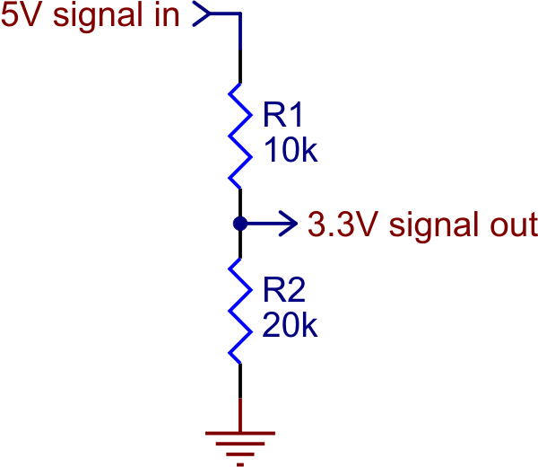

# Connection considerations.

While connecting Arduino UNO and ESP8266, it has to be taken into account that as Arduino UNO sends from (TX) to receiver of the ESP8266 (RX), Arduino UNO sends data in 5V; however, this voltage is considered as a dangerous voltage for the ESP8266, because it operates in 3.3V.

---

Note: If you use TX of ESP8266 to send data to Arduino UNO by using RX via UART. The data will be sent in 3.3V (because transmitter device operates in 3.3V). So, it will not make a problem, Arduino UNO will receive the data without any problem.

# Solution

Between the connection Arduino UNO (TX) -> ESP8266 (RX), voltage divider has to be used to convert 5V to 3.3V on the way. So, it will not damage the ESP8266 microcontroller. ***Diagram for voltage divider is shown at the bottom***

---

Schema will be like that: Arduino UNO (TX) (5V) -> Voltage Divider (3.3V Output) -> ESP8266 (RX)

# Diagram for Voltage Divider



R1 = 10kΩ, R2 = 20kΩ → Output = 5V × 20k / (10k + 20k) = **3.3V**

# Baud Rate

UART requires both devices to use the **same baud rate**. A mismatch will result in corrupted or unreadable data.

Both Arduino UNO and ESP8266 must be configured to the same baud rate in their respective code. A commonly used and stable baud rate for this communication is **9600 bps**, though **115200 bps** is also widely used if higher speed is needed.

```
Arduino UNO  →  Serial.begin(9600);
ESP8266      →  Serial.begin(9600);  // must match
```
